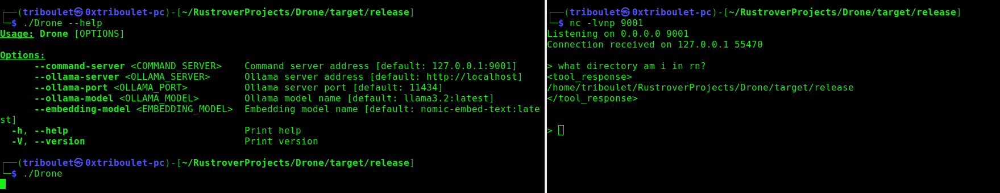

# Drone
Drone is a minimalist natural language command interface with inline semantic search for refined LLM (Large Language Model) function calling. It uses an Ollama server for natural language processing and embedding generation so that your LLM of choice can call necessary functions based on end-user prompts.



## Features
- Interactive natural language interface that leverages tools and models to process user prompts dynamically.
- Integrates with an Ollama server to enable language-based neural model functionalities.
- Embeds semantic search to find functions (tools) most relevant to user queries.
- Responds with either direct answers from the LLM or results generated from appropriate tools.
- Configurable through command-line arguments.

## Installation and Setup
1. **Clone the Repository**:
``` sh
    git clone <repository-url>
    cd Drone
```
1. **Install Dependencies**:
    - Add required dependencies to your `Cargo.toml` if they aren't already included:
``` toml
    [dependencies]
    ollama-rs = { version = "0.2.2", features = ["stream", "function-calling", "chat-history", "default"] }
    tokio = "1.41.1"
    serde_json = "1.0.133"
    async-trait = "0.1.83"
    clap = { version = "4.5.23", features = ["derive"] }
```
- Check additional dependencies like `async-trait` and `serde_json` which are used in the `functions` module.

1. **Compile the Project**:
``` sh
    cargo build --release
```
1. **Run the Project**: You can start the application using default configurations or provide custom arguments as follows:
``` sh
    ./Drone --command-server 192.168.1.100:9001 --ollama-server http://my-ollama-server --ollama-model custom-model:1.0
```
## Usage
### Command-Line Arguments
Drone uses [`clap`]() for easy command-line configuration. Below is the list of available options:

| Argument | Description | Default Value |
| --- | --- | --- |
| `--command-server` | Command server address. | `127.0.0.1:9001` |
| `--ollama-server` | Address of the Ollama server. | `http://localhost` |
| `--ollama-port` | Port number of the Ollama server. | `11434` |
| `--ollama-model` | LLM model name. | `llama3.2:latest` |
| `--embedding-model` | Embedding model name. | `nomic-embed-text:latest` |
| `--help or -h` | Displays help information. |  |
| `--version or -V` | Displays the current version of Drone. |  |
### Running the Application
To start the application:
``` sh
./Drone
```
### Example Custom Configuration
``` sh
./Drone --command-server 192.168.1.100:8000 \
        --ollama-server http://remote-ollama-server \
        --ollama-port 12345 \
        --ollama-model "custom-llm:1.0" \
        --embedding-model "custom-embed:2.0"
```
## Functionality Overview
1. **Prompt System**:
    - Displays a prompt for user input in the terminal or connected command stream (`>`).
    - Accepts user input, processes requests, and returns results or answers.

2. **Tool Matching**:
    - Uses embedding-based similarity search to compare user input with tool descriptions.
    - Tools include:
        - `GetCwdTool`: Retrieves the current working directory.
        - `CdTool`: Changes the current directory.
        - `ListDirTool`: Lists the contents of a directory.
        - `CatTool`: Reads and displays the content of a file.

3. **Ollama Server Integration**:
    - Processes natural language input with an Ollama server.
    - Supports embedding generation to match user queries with tools and models.

4. **Exit Command**:
    - Type `exit` to quit the application.

## Main Components
### `main.rs`
The main application file is responsible for:
- Parsing command-line arguments using `clap`.
- Establishing a connection to the command stream server.
- Loading and managing an Ollama server to process user requests.
- Dynamically selecting tools to perform operations based on user inputs.
- Structuring the communication between Ollama models, tools, and the user.

### Modules
1. **`functions`**: Contains implementations of tools:
    - `get_cwd`: Retrieves the current working directory.
    - `change_dir`: Changes the working directory.
    - `list_dir`: Lists directory content.
    - `cat_file`: Displays file contents.

2. **`antenna`**: Handles connections to the command server. Connects the system to its input/output stream.
3. **`config`**: Manages application configurations, including default values and argument parsing.
4. **`util`**: Includes helper functions for similarity calculations like cosine similarity between embeddings.

## Example Workflow
1. **Start the Application**:
``` sh
    ./Drone
```
1. **Input Query into Prompt**:
``` 
    > List all files in the current directory
```
1. **Tool Execution**:
    - The system identifies that the query matches the `ListDirTool` based on cosine similarity between embeddings.
    - Executes `ListDirTool` to list directory contents.

2. **Receive Output**:
``` 
    main.rs
    antenna.rs
    config.rs
    util.rs
```

## License
This project is licensed under the MIT License. See the `LICENSE` file for details.
## Acknowledgements
- [Ollama]() for providing tools for AI model integration.
- [`clap`]() for command-line argument parsing.
- Community contributions to improving Rust tooling.
